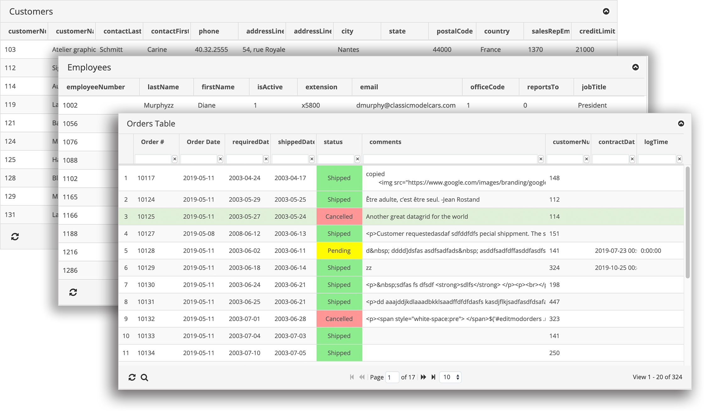

# pythonGrid



**[Quick Demo](https://demo.pythongrid.com/)**

pythonGrid is an easy way to create a fully working datagrid for Python web framework that connects to a relation database such as Postgres or MySql/MariaDB database. Currently only [Flask](https://palletsprojects.com/p/flask/) framework is supported. More frameworks support are coming.

## Requirements

* Python 3.6 (3.7, 3.8 support coming up)
* Flask (Django, Web2Py, CherryPy and other major web frameworks support are coming)
* SQLAlchemy

## Quick Start

A couple quick start options are available:

* [Download the latest release](https://github.com/pycr/pythongrid/archive/master.zip)
* Clone the repo (recommended):

```bash
git clone https://github.com/pycr/pythongrid.git
```

## Files included

Within the download you will see something like this:

```bash
├── LICENSE
├── README.md
├── app
│   ├── __init__.py
│   ├── data.py
│   ├── grid.py
│   ├── routes.py
│   ├── static
│   └── templates
│       ├── 404.html
│       ├── base.html
│       ├── grid.html
│       └── index.html
├── sample
│   ├── sampledb_postgres.sql
│   ├── sampledb_mysql.sql
├── config.py
├── index.py
└── requirements.txt
```

pythonGrid current has two main files in `grid.py` and `data.py` in **app** folder.

* `grid.py` is the main Python class that is responsible for creating the datagrid table. It relies on [jqGrid](https://free-jqgrid.github.io/getting-started/index.html), a popular jQuery datagrid plugin, to render grids in the browser. 

* `data.py` is a Python class that returns the data via AJAX to populate the grid from a database.

* `static` contains all of the client side Javascript and CSS files used for rendering.

## Creating the Database

Find the sample database in folder [**sampledb**](https://github.com/pycr/pythongrid/blob/master/app/sample/). Using your favorite MySQL os Postgres client (more database supports are coming).

1. Create a new database named `sampledb`
2. Run the sample sql script.

## Install Python

First of all, if you don't have Python installed on your computer, download and install from the [Python official website](https://www.python.org/downloads/) now.

To make sure your Python is functional, type `python3` in a terminal window, or just `python` if that does not work. Here is what you should expect to see:

```bash
Python 3.6.3 (v3.6.3:2c5fed86e0, Oct  3 2017, 00:32:08)
[GCC 4.2.1 (Apple Inc. build 5666) (dot 3)] on darwin
Type "help", "copyright", "credits" or "license" for more information.
>>>
```

Next, you need to install Flask framework. You got two options.

## Install Flask Framework via Virtual Environment

It is highly recommended to use [Python virtual environment](https://docs.python.org/3/tutorial/venv.html). Basically, a Python virtual environment is a self-contained separate copy of Python installation. Different applications can then use different virtual environments with different copy of Python without worrying about system permissions.

The following command will creates a virtual environment named `venv` stored in a directory also named `venv`.

```bash
python3 -m venv venv
```

Activate the new virtual environment:

```bash
source venv/bin/activate
```

Now the terminal prompt is modified to include the name of the activated virtual environment

```bash
(venv) $ _
```

With a new virtual environment created and activated, finally let's install dependents:

## Install Dependents

pythonGrid uses [SQLAlchemy](https://www.sqlalchemy.org/) to support different types of database.

```bash
pip install -r requirements.txt
```

## Configuration

Find file `config.py`, and set the database connection properties according to your environment. The demo uses MySQL database.

You can also use a socket to connect to your database without specifying a database host name. 

```python
PYTHONGRID_DB_HOSTNAME = 'mysqldatabase.example.com'
PYTHONGRID_DB_NAME = 'sampledb'
PYTHONGRID_DB_USERNAME = 'root'
PYTHONGRID_DB_PASSWORD = 'root'
PYTHONGRID_DB_TYPE = 'mysql+pymysql'
```

For Postgres set database type to `postgres+psycopg2`

```python
PYTHONGRID_DB_TYPE = 'postgres+psycopg2'
```

## Initialize Grid

Flask uses *view functions* to handle for the application routes. View functions are mapped to one or more route URLs so that Flask knows what logic to execute when a client requests a given URL such as **"https://example.com/grid"**.

We have two view functions that need initialization.

### index()

The file `routes.py` contains our `def index()` view functions associate with root URL `/`. This means that when a web browser requests the URL, Flask is going to invoke this function and pass the return value of it back to the browser as a response.

Inside the function, it creates a new instance of the PythonGrid class and assigns this object to the local variable `grid`. Note `orders` is a table from sample database [**sampledb**](https://github.com/pycr/pythongrid/blob/master/app/sample/).

```python
grid = PythonGrid('SELECT * FROM orders', 'orderNumber', 'orders')
```

PythonGrid initializer shown above requires 3 parameters:

1. A simple SQL SELECT statement
2. The database table primary key
3. The database table name

The view function pass the grid object into the rendered template from `grid.html` template.

```python
return render_template('grid.html', title='GRID', grid=grid)
```

### data()

Next, we need the data for the grid (thus the datagrid :-) 

In the next view function `data()`, we create a new instance for `PythonGridDbData` class that is responsible for retrieve data from the database.

It has requires only 1 parameter, which should be the SAME Sql Select statement used for PythonGrid.

```python
data = PythonGridDbData('SELECT * FROM orders')
```

## Hello, Grid

At this point, we can run our program with the command below

    flask run

It should give you a beautiful datagrid with data come from the table `orders`.

The pythonGrid supports

* Sort
* Row number
* Toolbar search
* Pagination
* Page size
* Column title
* Hide columns
* Datagrid dimension
* Column width
* Column text alignment

**[Run Demo](https://demo.pythongrid.com/)**
